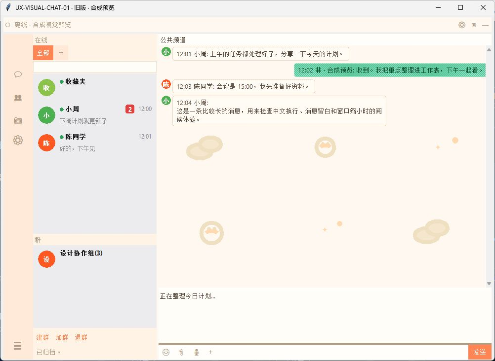
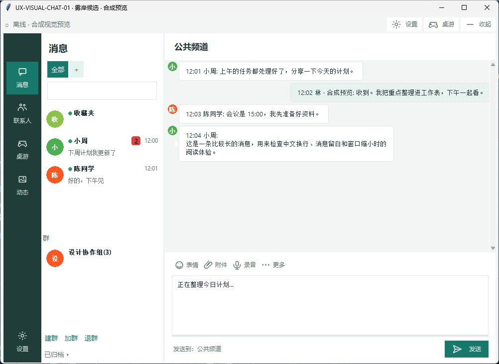
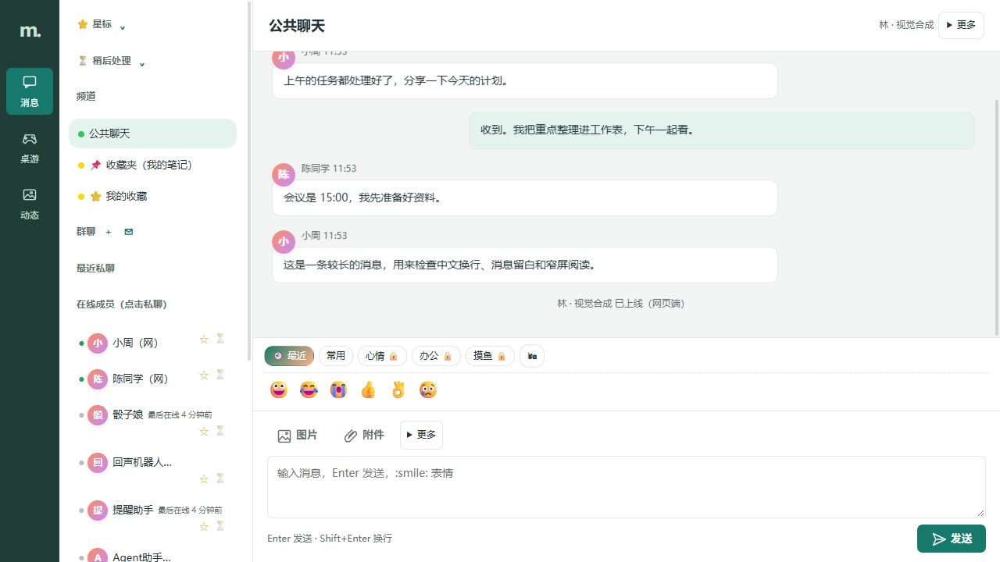

# 阶段运行截图（不是最终视觉验收）

三张图片均来自实际 Tk 或实际合成 Hub/HTTP 页面，只有本应用合成名字/消息，已独立检查公开边界。图片字节和当时应用文件 SHA 见 [stage-images.json](stage-images.json)。没有本次 PR head 的同版 EXE/最终截图声明。

- 桌面 before/after-r1 使用相同合成内容、1000×700 窗口、不透明。旧图尚未统一正常 main 的 early-DPI fixture，r1 图为早期10pt版本；当前代码已经11pt和进一步DPI修订。这两张仅展示布局发展，不作为最终清晰度对照或通过证明。
- Web r2 是实际页面的阶段截图，已去掉会话selected旧渐变/标题装饰；最终键鼠、窄屏/深色和同版候选验证仍未完成。

## 桌面旧版阶段

## 桌面首版雾岸阶段（10pt）

## Web 雾岸阶段

